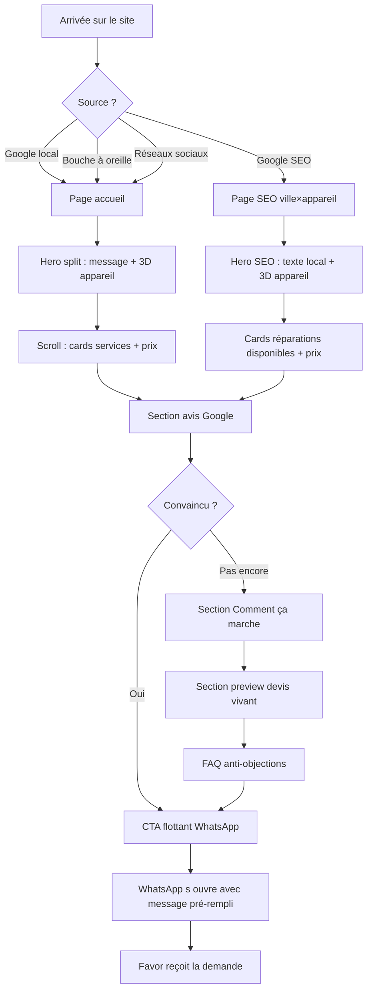
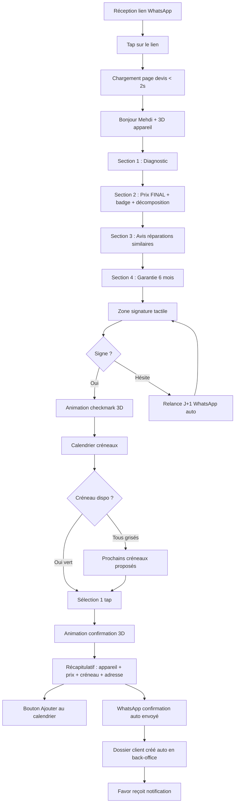
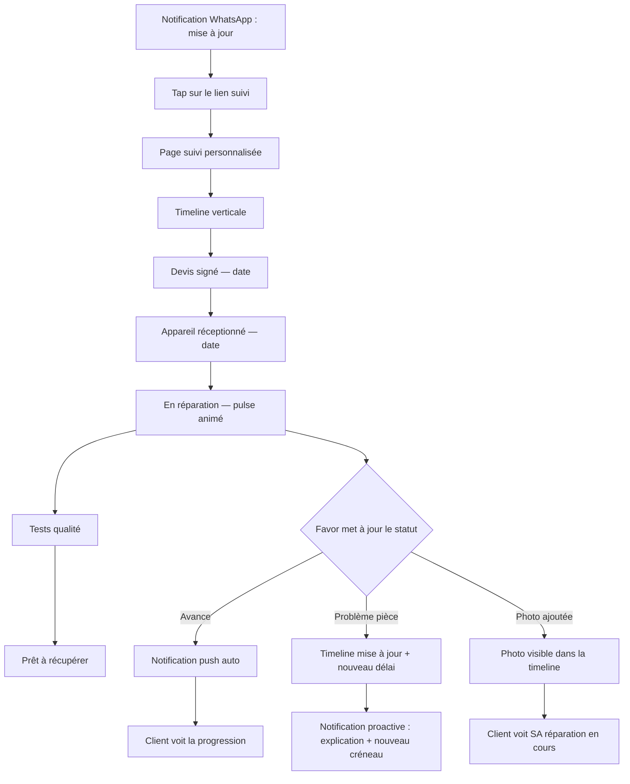
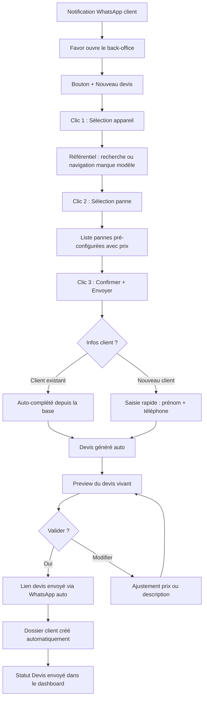
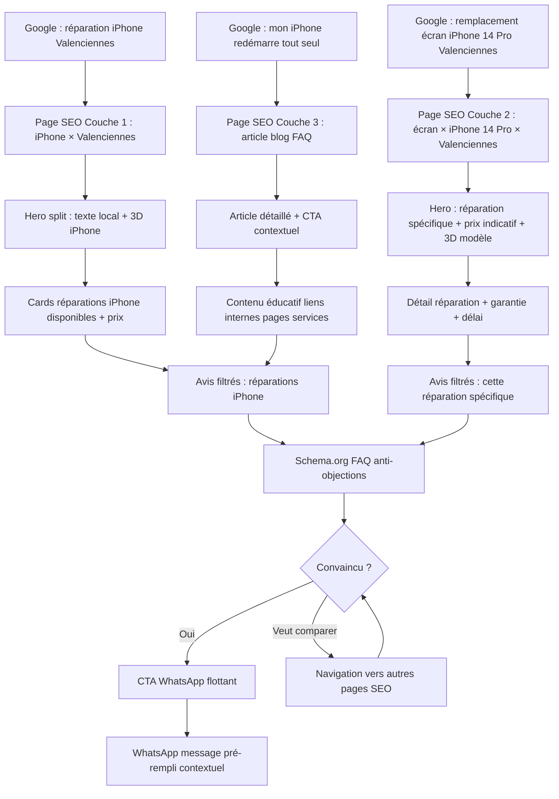
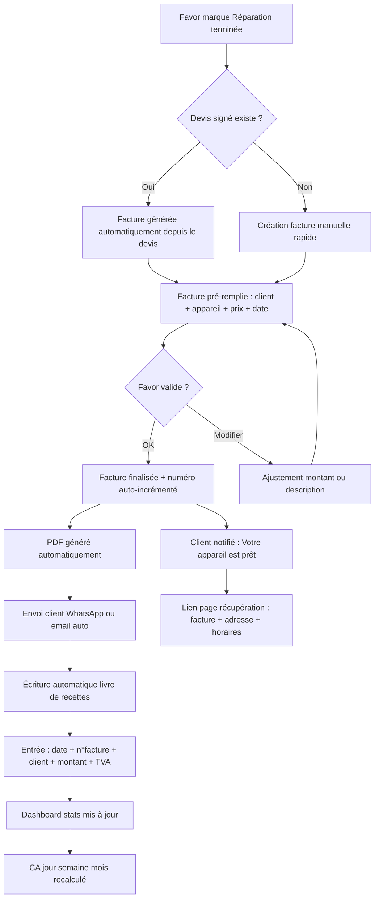
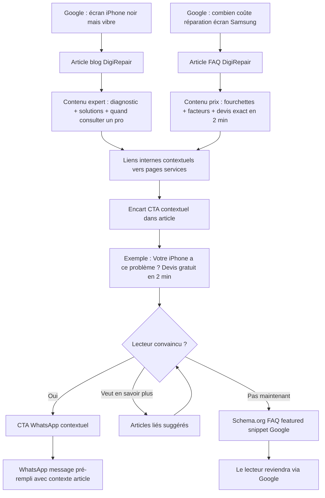

# UX Design Specification DigiRepair

**Author:** Favor
**Date:** 2026-02-19

---

## Executive Summary

### Project Vision

DigiRepair est une web app pour un réparateur d'électronique indépendant (Haulchin 59121, rayon 40km) qui résout 3 problèmes : le client fantôme (0% retour après SMS prix), le gouffre admin (1-2h/client en workflow manuel), et l'invisibilité Google. L'UX doit délivrer une expérience Apple-like qui crée le parallèle implicite "site soigné = microsoudure soignée".

Direction artistique moderne avec animations 3D stratégiques : chaque animation sert un objectif précis (montrer l'expertise, renforcer la confiance, guider la conversion). La 3D n'est jamais décorative — elle répond toujours à "pourquoi ça aide le client ?".

### Target Users

- **Mehdi (24 ans)** — Jeune connecté, mobile-first, habitué aux expériences Apple/Uber, veut rapidité et preuves
- **Nathalie (42 ans)** — Mère de famille méfiante, besoin de confiance, FAQ, garanties, visage humain
- **Favor (admin)** — Technicien solo, back-office calqué sur ses 7 sous-dossiers, mobile en atelier
- **Thomas (35 ans)** — Visiteur SEO long-terme, cherche info avant réparateur

### Key Design Challenges

1. Double persona (speed vs confiance) dans un seul site
2. Tunnel de conversion mobile-first critique (lien devis vivant < 2 min)
3. Back-office mobile-friendly pour usage en atelier
4. Milliers de pages SEO qui paraissent uniques et premium
5. Animations 3D performantes sans dégrader Lighthouse > 90

### Design Opportunities

1. Le parallèle "design soigné = microsoudure soignée" comme argument implicite
2. La contrainte fournisseur résolue visuellement par le design du calendrier
3. Les notifications WhatsApp brandées comme point de contact de marque
4. La photo/3D microsoudure en hero — visuel unique que personne n'a
5. Animations 3D stratégiques : appareil 3D, transitions timeline, modèles par page SEO, micro-interactions premium

## Core User Experience

### Defining Experience

L'expérience DigiRepair se définit par une cascade de 3 moments critiques, dans cet ordre :

**Moment 1 — La Première Impression (5 secondes)** : Le visiteur arrive sur le site et voit un design Apple-like avec animation 3D d'appareil, espace blanc, photo microsoudure. En 5 secondes, son cerveau enregistre : "c'est pas comme les autres réparateurs". La confiance est créée avant de lire un mot.

**Moment 2 — Le Lien Devis Vivant (2 minutes)** : Le client reçoit un lien personnalisé. Il voit son prénom, son appareil, le prix FINAL, la garantie, les avis de réparations similaires. Il signe au doigt, choisit un créneau, reçoit la confirmation avec animation 3D. En 2 minutes, il est passé de prospect à client engagé.

**Moment 3 — Le Back-Office 3 Clics** : Favor reçoit une demande, sélectionne appareil → panne → prix, envoie le lien. 2 minutes au lieu de 45. Le dossier se crée seul, la facture se génère seule, le livre de recettes s'alimente seul.

### Platform Strategy

- **Web App hybride** : SSR/SSG (vitrine publique + SEO) + SPA (back-office + espace client)
- **Mobile-first radical** : 80% du trafic mobile. Design pensé pour le pouce, CTA flottant permanent
- **Touch-first** : Signature au doigt, swipe timeline, scroll naturel, gestes natifs
- **Desktop** : Expérience enrichie avec animations 3D plus détaillées, hover effects premium
- **PWA-ready** : Installation sur écran d'accueil, notifications push
- **Pas d'offline** : Connexion requise (realtime est au coeur de l'expérience)

### Effortless Interactions

**Complètement automatique (zéro intervention) :**
- Création du dossier client à la signature du devis
- Génération devis/facture légalement conformes
- Alimentation du livre de recettes à chaque facturation
- Notifications WhatsApp/SMS à chaque changement de statut
- Relances anti-fantôme J+1, J+3, J+7
- Demande d'avis Google post-réparation
- Rappel automatique la veille du créneau
- Génération des pages SEO à partir du référentiel

**Complètement naturel (zéro réflexion) :**
- Le CTA WhatsApp est toujours visible → le client n'a jamais à chercher comment contacter
- Le calendrier créneau affiche vert/grisé → la contrainte fournisseur est invisible
- La timeline de réparation avance visuellement → le client comprend sans lire
- La signature est un geste au doigt → aussi simple que signer chez le livreur

### Critical Success Moments

| Moment | Réussite | Échec |
|---|---|---|
| Premier chargement du site | < 2s, animation 3D fluide, impression "wow c'est pro" | Lent, générique, ressemble aux autres |
| Ouverture du lien devis | "Bonjour [Prénom]", prix clair, confiance immédiate | Page froide, prix nu, méfiance |
| Signature + créneau | < 2 min du lien à la confirmation, dopamine du checkmark | Friction, hésitation, abandon |
| Première mise à jour timeline | Notification push, client voit la progression en temps réel | Silence, client appelle "c'est fini ?" |
| Création devis admin | 3 clics, < 2 min, zéro saisie répétitive | Formulaire long, friction, retour à Figma |

### Experience Principles

1. **Le silence est un signal** — Chaque espace blanc, chaque animation 3D mesurée, chaque couleur rare (#2084D7 CTA uniquement) dit au client : "on maîtrise". Le vide est un argument.

2. **Zéro friction, zéro réflexion** — Si le client doit réfléchir à comment faire quelque chose, c'est un échec UX. Le parcours guide par le design, pas par les instructions.

3. **L'automatique est invisible** — Le client ne sait pas que le dossier se crée seul, que la facture se génère, que le rappel s'envoie. Il voit juste un service impeccable. Favor ne sait pas que le livre de recettes s'alimente — il voit juste du temps libre.

4. **La 3D sert le message** — Chaque animation 3D répond à "pourquoi ça aide le client ?". Appareil qui tourne = expertise visible. Checkmark animé = dopamine de confirmation. Modèle 3D par page SEO = "c'est MON appareil".

5. **Mobile-first, pas mobile-aussi** — Le site est conçu pour un pouce sur un écran de 375px. Le desktop est une version enrichie, pas l'inverse.

## Desired Emotional Response

### Primary Emotional Goals

DigiRepair vise un triptyque émotionnel où chaque émotion renforce les autres :

**Confiance** — "Je suis entre de bonnes mains"
Le design soigné = la microsoudure soignée. La transparence totale (prix FINAL, timeline visible, photos de MON appareil) élimine l'anxiété. Le client ne se demande jamais "est-ce que ça va bien se passer ?".

**Fluidité** — "C'est tellement simple que c'est presque magique"
Signature au doigt en 2 secondes. Créneau en 1 tap. Devis en 3 clics. Le client et l'admin ne ressentent jamais de friction. L'expérience coule comme de l'eau — on ne la remarque pas, on la vit.

**Premium** — "C'est pas un réparateur lambda"
L'espace blanc, les animations 3D, la palette maîtrisée, le silence visuel. Le client ressent qu'il est dans le top 1%. Le parallèle implicite : si le site est aussi soigné, la réparation le sera aussi.

### Emotional Journey Mapping

| Étape du parcours | Émotion visée | Déclencheur UX |
|---|---|---|
| Découverte du site (5 sec) | Surprise + Premium | Animation 3D hero, espace blanc, photo microsoudure |
| Lecture des services | Confiance | Avis en grand, garantie visible, visage de Favor |
| Contact WhatsApp | Fluidité | Message pré-rempli, CTA flottant, zéro formulaire |
| Réception lien devis | Personnalisation | "Bonjour [Prénom]", appareil identifié, prix contextualisé |
| Lecture du prix | Transparence | Badge "Prix FINAL", décomposition, zéro surprise |
| Signature + créneau | Accomplissement | Geste naturel au doigt, calendrier vert/grisé, checkmark 3D |
| Attente réparation | Contrôle | Timeline pulse, notifications push, photos de progression |
| Récupération | Satisfaction | Appareil propre, facture auto, expérience complète |
| Demande d'avis | Reconnaissance | Message chaleureux, lien direct Google, fierté d'avoir bien choisi |
| Retour (famille/ami) | Fidélité | Historique visible, confiance établie, zéro friction |

### Micro-Emotions

**À cultiver :**
- **Confiance > Scepticisme** — Chaque élément visuel prouve la qualité avant les mots (avis, photos, design premium)
- **Contrôle > Anxiété** — Le client sait toujours où en est sa réparation (timeline temps réel)
- **Accomplissement > Friction** — Chaque action complétée est célébrée (checkmark 3D, confirmation animée)
- **Delight > Satisfaction** — Les micro-animations 3D créent des moments "oh, c'est joli" qui élèvent l'ordinaire

**À éviter :**
- **Méfiance** — Zéro surprise sur le prix, zéro frais caché, zéro zone d'ombre
- **Confusion** — Une seule action par écran, un seul CTA par vue, guidage par le design
- **Abandon** — Relances douces (pas agressives), CTA toujours visible, WhatsApp permanent
- **Frustration** — Chargement < 2s, zéro formulaire, zéro étape inutile

### Quand ça va mal — Transparence calme

| Situation | Émotion visée | Réponse UX |
|---|---|---|
| Pièce en retard | Contrôle calme | Timeline mise à jour en temps réel, notification proactive "Pièce en livraison, nouveau créneau proposé" |
| Panne plus grave que prévu | Confiance maintenue | Message personnel via WhatsApp, explication claire, nouveau devis si nécessaire avec même expérience premium |
| Bug technique | Tolérance | Design d'erreur soigné (pas de page blanche), message humain, alternative proposée |
| Délai plus long que prévu | Transparence | Estimation mise à jour sur la timeline, notification push, le client n'a jamais à appeler |

**Principe :** Quand ça va mal, DigiRepair ne se cache pas — il communique PLUS. Le silence est l'ennemi. La transparence transforme un problème en preuve de sérieux.

### Design Implications

| Émotion | Implication UX |
|---|---|
| Confiance | Avis en grand (pas en petit), visage de Favor, garantie omniprésente, badge "Prix FINAL" |
| Fluidité | Maximum 1 action par écran, CTA unique, gestes natifs, zéro saisie manuelle quand évitable |
| Premium | Espace blanc 60-70%, palette stricte (bleu vif = CTA uniquement), animations 3D mesurées, typo élégante |
| Contrôle | Timeline toujours visible, notifications proactives, estimation temps restant |
| Accomplissement | Checkmark 3D animé, confirmation "C'est confirmé !", ajout calendrier en 1 tap |
| Transparence | Prix décomposé, étapes visibles, photos de SON appareil, zéro zone d'ombre |

### Emotional Design Principles

1. **Le premium crée la confiance** — Un site qui respire le soin inspire la confiance avant toute interaction. Le design est le premier argument de vente.

2. **La fluidité est invisible** — Si l'utilisateur remarque l'UX, c'est qu'il y a de la friction. L'expérience parfaite ne se remarque pas, elle se vit.

3. **L'accomplissement se célèbre** — Chaque action complétée mérite un feedback visuel (animation 3D, transition, checkmark). Les micro-célébrations créent de la dopamine et du plaisir.

4. **La transparence est proactive** — Ne jamais attendre que le client demande. Les mises à jour arrivent AVANT la question. Le silence n'existe pas chez DigiRepair.

5. **L'erreur est humaine** — Quand ça va mal, le ton est calme, honnête, et la solution est proposée dans le même souffle que le problème. Jamais de panique, jamais de silence.

## UX Pattern Analysis & Inspiration

### Inspiring Products Analysis

**Apple — Le Maître du Silence Visuel**
- Résout : la complexité technologique → la rend invisible
- UX clé : 70% espace blanc, une seule idée par écran, scroll storytelling, animations fluides qui servent le propos, photos produit qui SONT le message
- Ce qui ramène : la cohérence. Chaque pixel est à sa place. La confiance naît de la maîtrise visuelle
- Pour DigiRepair : le hero section, le scroll narratif, la palette stricte, les animations 3D d'appareils, le "moins = plus"

**Uber — Le Maître de la Transparence Temps Réel**
- Résout : l'anxiété de l'attente → la transforme en contrôle
- UX clé : carte en temps réel, étapes visibles, estimation temps, notifications push à chaque changement, zéro besoin d'appeler
- Ce qui ramène : le sentiment de contrôle total sur un service qu'on ne maîtrise pas physiquement
- Pour DigiRepair : la timeline de réparation, les notifications proactives, le pulse animé sur l'étape en cours, "votre appareil est entre de bonnes mains"

**Netflix — Le Maître de la Personnalisation**
- Résout : "qu'est-ce que je regarde ?" → recommandation sur mesure
- UX clé : interface adaptée à l'utilisateur, previews au hover, auto-play, navigation par catégories intelligentes, zéro friction pour commencer à regarder
- Ce qui ramène : "Netflix me connaît". L'expérience personnelle, pas générique
- Pour DigiRepair : le lien devis vivant personnalisé ("Bonjour Mehdi"), les avis filtrés par type de réparation, les pages SEO qui montrent SON appareil, le "fait pour toi"

**Amazon — Le Maître de la Preuve Sociale**
- Résout : "est-ce que c'est bien ?" → les autres ont déjà répondu
- UX clé : avis massifs, notes étoiles visibles partout, "X personnes ont acheté", photos client, questions/réponses, "les clients ont aussi acheté"
- Ce qui ramène : la certitude. L'avis des autres élimine le doute
- Pour DigiRepair : avis Google en grand, avis filtrés par réparation similaire, compteur "347 appareils réparés", preuve sociale au moment de la décision (page devis vivant)

### Transferable UX Patterns

**Navigation & Structure (Apple)**
- Scroll storytelling vertical avec sections alternées blanc/gris-bleu → page d'accueil DigiRepair
- Une idée par écran, un CTA par vue → tunnel devis vivant
- Nav sticky transparente avec blur → navigation globale

**Temps Réel & Feedback (Uber)**
- Timeline à étapes avec étape courante animée → suivi réparation
- Notifications push à chaque transition → WhatsApp/SMS auto
- Estimation temps restant → "Prêt dans ~45 min"
- Carte de localisation → "À 12 minutes de Valenciennes centre"

**Personnalisation & Pertinence (Netflix)**
- "Bonjour [Prénom]" + contenu adapté → page devis vivant
- Previews au hover sur les cards → cards services avec élévation 3D
- Catégories intelligentes → pages SEO par appareil/ville
- Autoplay/auto-action → dossier client auto-créé, facture auto-générée

**Preuve Sociale & Confiance (Amazon)**
- Avis visibles partout, pas cachés → carrousel avis style Apple
- Avis filtrés par catégorie → avis par type de réparation sur chaque page SEO
- "X personnes ont acheté" → "347 appareils réparés"
- Questions/réponses → FAQ Schema.org anti-objections

### Anti-Patterns to Avoid

| Anti-Pattern | Source | Pourquoi l'éviter |
|---|---|---|
| Carousel auto-play agressif | Sites e-commerce bas de gamme | Distrait, frustre, réduit le contrôle utilisateur |
| Pop-up newsletter à l'arrivée | 90% des sites | Interrompt la première impression, tue le premium |
| Menu hamburger avec 15+ items | Apps surchargées | Paradoxe du choix — max 4-5 items nav |
| Formulaire de contact classique | Sites de réparateurs concurrents | Les jeunes ne remplissent pas de formulaires → WhatsApp |
| Listing grille de prix brut | Concurrents | Prix nu = client fantôme. Le prix doit être habillé de contexte |
| Page 404 par défaut | Négligence technique | Chaque erreur doit être soignée = preuve de maîtrise |
| Dark patterns (urgence fausse) | E-commerce agressif | Détruit la confiance. DigiRepair vend la transparence |
| Animations lourdes qui bloquent | Sites "créatifs" | Lighthouse > 90, chargement < 2s non négociable |

### Design Inspiration Strategy

**Adopter tel quel :**
- Apple : scroll storytelling, espace blanc 60-70%, une idée par écran
- Uber : timeline à étapes avec pulse animé, notifications push proactives
- Amazon : avis en grand, preuve sociale au moment de la décision

**Adapter à DigiRepair :**
- Netflix : personnalisation → "Bonjour [Prénom]" sur le devis vivant + avis filtrés par réparation similaire (pas un algorithme de recommandation complet)
- Apple : animations 3D → modèles d'appareils 3D sur les pages SEO et hero, mais avec budget performance strict (lazy-load, fallback statique)
- Uber : carte temps réel → version simplifiée "À X minutes de [Ville]" sur les pages SEO, pas une carte interactive complexe au MVP

**Éviter absolument :**
- Toute forme de pop-up, newsletter interrupt, dark pattern
- Formulaires classiques (WhatsApp remplace tout)
- Prix sans contexte (l'anti-pattern n°1 du secteur)
- Animations qui pénalisent la performance

## Design System Foundation

### Design System Choice

**shadcn/ui + Tailwind CSS + React Three Fiber**

Stack design system en 3 couches :
- **Tailwind CSS** — Fondation utility-first, palette 3+1 couleurs configurée dans tailwind.config, responsive mobile-first, purge CSS pour performance maximale
- **shadcn/ui (Radix)** — Composants accessibles copiés dans le projet (Button, Dialog, Form, Calendar, Tabs, Dropdown, Toast, Sheet). Zéro dépendance runtime, contrôle total sur le style
- **React Three Fiber (R3F)** — Animations 3D déclaratives en React. Lazy-loaded par section, fallback statique sur mobile bas de gamme

### Rationale for Selection

1. **Liberté visuelle totale** — shadcn/ui n'impose aucun style. La DA Apple-like (#2084D7 / #1F2E53 / #F8F9FA / #E8ECF1) se configure nativement sans fight contre des defaults
2. **Dev solo efficace** — Composants pré-construits et testés (accessibilité, clavier, aria) = pas besoin de réinventer les bases. Focus sur l'expérience unique
3. **Performance Lighthouse > 90** — Tailwind purge le CSS inutilisé, shadcn n'ajoute pas de runtime, R3F se lazy-load. Bundle pages publiques < 150KB gzip
4. **Écosystème Next.js natif** — shadcn/ui est LE standard de l'écosystème Next.js 2025-2026. Documentation abondante, patterns établis, communauté active
5. **Animations 3D sans compromis** — R3F permet des modèles 3D d'appareils, des transitions animées, des micro-interactions premium tout en restant dans l'écosystème React

### Implementation Approach

**Tailwind Config :**
```
colors: {
  primary: '#2084D7',    // CTA uniquement
  dark: '#1F2E53',       // Textes, titres, fonds sombres
  soft: '#F8F9FA',       // Fond principal
  alt: '#E8ECF1',        // Sections alternées
}
```

**shadcn/ui Composants prévus :**
- Button, Input, Label, Form — formulaires back-office + devis
- Dialog, Sheet — modales et panneaux latéraux
- Calendar — sélection créneau (logique fournisseur J+1/18h)
- Tabs — navigation dossier client (7 modules)
- Toast — notifications in-app
- Card — cards services, cards dossier, cards avis
- Badge — statuts réparation, "Prix FINAL"
- Separator, Skeleton — structure et loading states

**React Three Fiber :**
- Hero section : modèle 3D appareil en rotation
- Pages SEO : modèle 3D de l'appareil concerné (lazy-loaded)
- Confirmation devis : animation checkmark 3D
- Timeline : transitions 3D entre étapes (optionnel, progressive enhancement)

### Customization Strategy

**Tokens de design :**
- Couleurs : palette 3+1 stricte, pas de couleur supplémentaire
- Typographie : une seule famille (Inter ou équivalent), 4 tailles (sm, base, lg, xl)
- Espacements : échelle Tailwind standard (4, 8, 12, 16, 24, 32, 48, 64px)
- Border-radius : uniformes (8px cards, 12px buttons, full pour avatars)
- Shadows : 3 niveaux (sm pour cards, md pour hover, lg pour modales)

**Composants custom à créer :**
- TimelineStep — pastille + ligne + pulse animé (suivi réparation)
- DevisVivant — layout 4 blocs vertical (appareil → prix → avis → CTA)
- SignaturePad — zone signature tactile mobile
- FloatingCTA — bouton flottant mobile permanent
- WhatsAppButton — CTA WhatsApp avec message pré-rempli
- SEOPageTemplate — template générique pages ville × marque × pièce
- AdminDashboardCard — card dossier client avec statut couleur
- PhotoUploader — upload photos depuis mobile en atelier

**Progressive Enhancement 3D :**
- Desktop : animations 3D complètes (rotation, transitions)
- Mobile haut de gamme : animations 3D simplifiées (rotation seule)
- Mobile bas de gamme : fallback image statique haute qualité
- Détection via `navigator.hardwareConcurrency` et `deviceMemory`

## Defining Core Experience

### The One-Liner

**"Tu reçois un lien, tu signes, tu choisis ton créneau, c'est fait."**

C'est la phrase que Mehdi dit à son pote quand il recommande DigiRepair. Pas de mention du site, pas de mention du prix — juste la fluidité du parcours. Le lien devis vivant transforme un prix froid en tunnel de conversion chaud.

### User Mental Model

**Modèle actuel (cassé) :**
SMS prix → client réfléchit seul → doute → oublie → fantôme (0% retour)

**Modèle DigiRepair :**
Lien personnalisé → "Bonjour Mehdi" → prix contextualisé + avis + garantie → signature au doigt → créneau en 1 tap → confirmation 3D → client engagé

La rupture : le client ne reçoit plus un prix, il reçoit une **expérience de conversion**. Le lien remplace le SMS comme le smartphone a remplacé le téléphone à clapet.

### Success Criteria

| Critère | Cible | Mesure |
|---|---|---|
| Temps lien → confirmation | < 2 minutes | Analytics front-end |
| Taux de signature après ouverture | > 60% | Conversion funnel |
| Sentiment à la signature | "C'était simple" | Micro-survey post-signature |
| Zéro confusion | 0 appel "comment je fais ?" | Support tickets |
| Signature naturelle | Geste au doigt fluide | UX testing mobile |

### Novel UX Patterns

**Le Lien Devis Vivant n'est pas un pattern nouveau — c'est une combinaison nouvelle de patterns familiers :**

| Pattern familier | Source | Application DigiRepair |
|---|---|---|
| Tunnel e-commerce one-page | Shopify Checkout | Prix → signature → créneau en scroll vertical |
| Prise de RDV en ligne | Doctolib | Calendrier créneaux avec contrainte fournisseur invisible |
| Suivi temps réel | Uber | Timeline post-signature avec pulse animé |
| Personnalisation contextuelle | Netflix | "Bonjour [Prénom]", avis filtrés par réparation similaire |
| Preuve sociale au moment critique | Amazon | Avis de réparations similaires affichés AVANT la signature |

**Ce qui est novel :** la combinaison de ces 5 patterns dans un seul lien, pour un artisan réparateur. Aucun concurrent ne propose ça. La familiarité de chaque pattern individuel garantit zéro apprentissage pour l'utilisateur.

### Experience Mechanics

**Phase 1 — Initiation (0-5 sec)**
Le client reçoit un lien WhatsApp personnalisé. Il tape, la page charge en < 2s. Il voit son prénom, son appareil, une micro-animation 3D de l'appareil concerné. Premier signal : "c'est fait pour MOI".

**Phase 2 — Interaction (5 sec - 1 min)**
Scroll vertical naturel : prix FINAL avec badge → décomposition transparente → avis de réparations similaires → garantie → bouton signature. Chaque section renforce la confiance. Le CTA est toujours visible en bas.

**Phase 3 — Feedback (1-1.5 min)**
Signature au doigt → animation checkmark 3D (dopamine) → calendrier créneaux (vert = dispo, grisé = pris, contrainte fournisseur invisible) → sélection en 1 tap.

**Phase 4 — Completion (1.5-2 min)**
Animation de confirmation 3D → récapitulatif (appareil, prix, créneau, adresse) → bouton "Ajouter au calendrier" → message WhatsApp de confirmation auto. Le dossier client se crée en arrière-plan. Favor reçoit la notification.

## Visual Design Foundation

### Color System

**Palette Principale 3+1 :**

| Token | Hex | Usage | Ratio contraste (sur #F8F9FA) |
|---|---|---|---|
| `primary` | `#2084D7` | CTA uniquement — boutons d'action, liens actifs | 3.5:1 (AA large) |
| `dark` | `#1F2E53` | Titres, textes principaux, fonds sombres (footer, hero) | 10.5:1 (AAA) |
| `soft` | `#F8F9FA` | Fond principal, respiration visuelle | — |
| `alt` | `#E8ECF1` | Sections alternées, cards, fonds secondaires | — |

**Couleurs sémantiques :**

| Token | Hex | Usage |
|---|---|---|
| `success` | `#16A34A` | Créneau disponible, étape validée, checkmark |
| `warning` | `#F59E0B` | Attente pièce, délai modifié |
| `error` | `#DC2626` | Erreur formulaire, paiement échoué |
| `info` | `#2084D7` | Notifications, badges informatifs (réutilise primary) |
| `muted` | `#6B7280` | Textes secondaires, labels, placeholders |
| `border` | `#E2E8F0` | Séparateurs, contours de cards |

**Règles d'usage couleur :**
- `#2084D7` est SACRÉ — uniquement pour les CTA et éléments interactifs. Jamais décoratif
- Le ratio espace blanc / contenu vise 60-70% (principe Apple)
- Les fonds alternent `soft` / `alt` en scroll storytelling
- Le mode sombre n'est pas prévu au MVP (complexité × 2 pour un dev solo)

### Typography System

**Famille : Inter**

Équivalent open-source de SF Pro (Apple). Géométrique, moderne, excellente lisibilité sur écran, variable font pour performance optimale.

| Niveau | Taille | Poids | Line-height | Usage |
|---|---|---|---|---|
| `display` | 48px / 3rem | 700 (Bold) | 1.1 | Hero titre, chiffre clé |
| `h1` | 36px / 2.25rem | 700 (Bold) | 1.2 | Titres de page |
| `h2` | 28px / 1.75rem | 600 (Semibold) | 1.3 | Titres de section |
| `h3` | 22px / 1.375rem | 600 (Semibold) | 1.4 | Sous-titres, cards |
| `body` | 16px / 1rem | 400 (Regular) | 1.6 | Texte courant |
| `body-sm` | 14px / 0.875rem | 400 (Regular) | 1.5 | Labels, texte secondaire |
| `caption` | 12px / 0.75rem | 500 (Medium) | 1.4 | Badges, metadata, timestamps |

**Règles typographiques :**
- Une seule famille (Inter) — la variation vient du poids et de la taille, pas du mélange de polices
- Couleur texte : `#1F2E53` sur fond clair, `#F8F9FA` sur fond sombre
- Pas d'italique sauf citations — le gras suffit pour la hiérarchie
- Tailles mobile : `display` → 32px, `h1` → 28px, `h2` → 24px (scale ratio 0.85)
- Variable font unique fichier (~100KB) chargée en `font-display: swap`, preload

### Spacing & Layout Foundation

**Unité de base : 4px**

Échelle d'espacement cohérente :

| Token | Valeur | Usage typique |
|---|---|---|
| `space-1` | 4px | Micro-gaps (icône-label) |
| `space-2` | 8px | Gaps internes cards, padding inputs |
| `space-3` | 12px | Gap entre éléments liés |
| `space-4` | 16px | Padding cards, gap formulaires |
| `space-6` | 24px | Gap entre groupes d'éléments |
| `space-8` | 32px | Padding sections mobile |
| `space-12` | 48px | Gap entre sections mobile |
| `space-16` | 64px | Gap entre sections desktop |
| `space-24` | 96px | Respiration hero, séparation majeure |

**Système de grille :**
- Mobile (375px) : 1 colonne, padding horizontal 16px
- Tablet (768px) : 2 colonnes, gap 24px, padding 32px
- Desktop (1280px) : 12 colonnes, gap 24px, max-width 1200px centré
- Large (1440px+) : contenu centré, marges auto croissantes

**Principes de layout :**
1. **Scroll storytelling vertical** — Sections pleine largeur alternant `soft`/`alt`, une idée par section (Apple)
2. **CTA flottant mobile** — Bouton fixe en bas d'écran, jamais masqué par le scroll, z-index maximum
3. **Cards avec élévation** — `shadow-sm` au repos, `shadow-md` au hover, `border-radius: 8px`
4. **Conteneur de lecture** — Texte limité à 65 caractères/ligne (max-width 640px pour le prose)

### Accessibility Considerations

**Contrastes validés :**
- `#1F2E53` sur `#F8F9FA` → 10.5:1 (AAA) — texte principal
- `#2084D7` sur `#F8F9FA` → 3.5:1 (AA large text) — CTA buttons avec texte blanc inversé : `#FFFFFF` sur `#2084D7` → 4.6:1 (AA)
- `#6B7280` sur `#F8F9FA` → 5.0:1 (AA) — texte secondaire

**Tailles minimales :**
- Cibles tactiles : minimum 44×44px (WCAG 2.5.5)
- Texte body : jamais sous 14px
- CTA buttons : minimum 48px hauteur sur mobile

**Focus & Navigation :**
- Focus ring visible `2px solid #2084D7` offset 2px sur tous les éléments interactifs
- Ordre de tabulation logique (haut → bas, gauche → droite)
- Skip-to-content link en première position
- Aria-labels sur tous les éléments interactifs non-textuels (icônes, 3D)

**Animations & Motion :**
- `prefers-reduced-motion: reduce` → désactive toutes les animations 3D et transitions, fallback images statiques
- Aucune animation auto-play qui ne peut être arrêtée
- Durées de transition : 150-300ms max (pas de lenteur artificielle)

## Design Direction Decision

### Design Directions Explored

6 directions visuelles explorées via showcase HTML interactif (`ux-design-directions.html`) :

| Direction | Approche | Verdict |
|---|---|---|
| D1 Minimal Apple | Espace blanc 70%, scroll storytelling | Trop vide pour Nathalie |
| D2 Bold & Confident | Hero sombre, contraste fort | Hero sombre trop clivant |
| D3 Card-Centric | Dense, cards, prix visibles | Efficace mais manque de wow |
| D4 Split Hero | 50/50 texte/visuel, élégant | Élégant mais trop conventionnel seul |
| D5 Immersif Full-Bleed | Alternance dark/light dramatique | Fort mais complexe dev solo |
| D6 Dashboard | Sidebar, cards dossiers | Retenu tel quel pour le back-office |

### Chosen Direction

**Hybride D4 × D3** pour la vitrine publique, **D6** pour le back-office.

**Vitrine publique — D4 × D3 :**
- **Hero split 50/50** : message + stats à gauche, animation 3D appareil à droite
- **Double CTA** : action primaire ("Envoyer via WhatsApp") + action secondaire ("Voir les tarifs")
- **Cards compactes en grille** : services, appareils, prix dès le deuxième écran
- **Avis denses** : note globale en header + grille de cards avis filtrables
- **Sections alternées soft/alt** : storytelling structuré mais sans sections dark (réservées au footer)
- **Preview devis vivant** : mini-mockup du tunnel de conversion intégré dans une section

**Back-office — D6 :**
- **Sidebar navigation** : 7 modules (Dossiers, Devis, Factures, Agenda, Stats, Référentiel, Réglages)
- **Cards dossiers** : ligne par dossier avec icône appareil, nom client, statut couleur, action rapide
- **Stats rapides** : 4 compteurs en haut (en cours, attente pièce, prêts, total)
- **Mobile atelier** : sidebar → hamburger, cards empilées, CTA flottant "+ Nouveau devis"

### Design Rationale

1. **Le split hero D4 crée le parallèle Apple** — L'espace 50/50 permet une animation 3D grande et impactante à droite pendant que le message + les stats convainquent à gauche
2. **Les cards D3 répondent à Nathalie** — Prix visibles, services clairs, avis accessibles sans scroller 10 écrans. L'info est là quand on la cherche
3. **Le combo évite le vide et le cheap** — D4 seul manque de densité, D3 seul manque de premium. Ensemble = premium ET efficace
4. **D6 pour le back-office est naturel** — Le pattern sidebar + cards liste est le standard des dashboards, familier pour Favor, adapté aux 7 modules existants
5. **Complexité dev maîtrisée** — Pas de sections dark/light alternées complexes (D5), pas de scroll storytelling infini (D1). Un hero split + des grilles de cards = patterns bien documentés dans shadcn/ui

### Implementation Approach

**Page d'accueil (vitrine) :**
1. Nav sticky transparente avec blur (shadcn NavigationMenu)
2. Hero split : texte/stats (gauche) + canvas R3F appareil 3D (droite)
3. Section cards services : grille 3-4 colonnes (shadcn Card)
4. Section avis : header note globale + grille 3 colonnes (shadcn Card)
5. Section "Comment ça marche" : 4 étapes horizontales
6. Section preview devis vivant : mini-mockup centré
7. Footer dark avec infos pratiques

**Pages SEO :**
- Même structure split : texte SEO gauche + modèle 3D appareil droite
- Cards réparations disponibles en grille
- Avis filtrés par type d'appareil

**Back-office :**
- Layout sidebar fixe (240px) + zone principale scrollable
- Header avec stats rapides (4 compteurs)
- Liste dossiers en cards ligne (icône + nom + statut + action)
- Responsive : sidebar → sheet mobile (shadcn Sheet)

## User Journey Flows

### J1 — Découverte → Contact WhatsApp

**Persona :** Mehdi (mobile) / Nathalie (mobile ou desktop)
**Objectif :** Arriver sur le site → être convaincu → envoyer un message WhatsApp
**Durée cible :** < 30 secondes du chargement au clic WhatsApp



**Points de friction éliminés :**
- Pas de formulaire de contact (WhatsApp remplace tout)
- CTA flottant toujours visible → zéro scroll pour contacter
- Message pré-rempli : "Bonjour, j'ai un [appareil] avec [problème]..."
- Avis visibles AVANT le CTA → la preuve sociale déclenche l'action

### J2 — Lien Devis Vivant → Signature → Créneau

**Persona :** Mehdi
**Objectif :** Ouvrir le lien → signer → choisir créneau → confirmation
**Durée cible :** < 2 minutes



**Moments de delight :**
- "Bonjour [Prénom]" → personnalisation immédiate
- Checkmark 3D après signature → dopamine
- Confirmation 3D → sentiment d'accomplissement
- Zéro saisie côté client (tout est pré-rempli par Favor)

**Gestion d'erreur :**
- Lien expiré → page "Ce devis a expiré, contactez-nous" + CTA WhatsApp
- Signature non complétée → relances auto J+1, J+3, J+7 (douces, pas agressives)
- Aucun créneau dispo → message "Nous vous contactons sous 24h pour un créneau"

### J3 — Suivi de Réparation Temps Réel

**Persona :** Mehdi / Nathalie
**Objectif :** Savoir où en est sa réparation → zéro appel
**Durée cible :** < 10 secondes pour voir le statut



**Pattern Uber appliqué :**
- Timeline à étapes avec pulse animé sur l'étape en cours
- Notifications push à chaque transition (pas seulement à la fin)
- Estimation temps restant quand pertinent
- Photos de l'appareil en cours de réparation → preuve visuelle

### J4 — Back-Office : Création Devis 3 Clics

**Persona :** Favor (mobile en atelier)
**Objectif :** Client contacte → devis envoyé en < 2 minutes
**Durée cible :** 3 clics, < 2 minutes



**Optimisations admin :**
- Référentiel pré-configuré : marques → modèles → pannes → prix = zéro saisie prix
- Client existant = auto-complété (prénom + téléphone suffisent)
- Preview avant envoi = filet de sécurité
- Envoi WhatsApp automatique avec le lien devis vivant
- Mobile-friendly : utilisable debout en atelier avec une seule main

### J5 — Visiteur SEO → Confiance → Contact

**Persona :** Thomas
**Objectif :** Recherche Google → page SEO → convaincu → contact
**Durée cible :** < 1 minute pour être convaincu



**Stratégie SEO multi-couche :**
- Couche 1 (catégorie × ville) : pages larges, trafic volume
- Couche 2 (marque × pièce × modèle × ville) : pages spécifiques, intention forte
- Couche 3 (blog/FAQ) : contenu éducatif, longue traîne
- Chaque page a ses avis filtrés → pertinence maximale
- Schema.org sur chaque page → rich snippets Google

### J6 — Facturation → Livre de Recettes

**Persona :** Favor
**Objectif :** Réparation terminée → facture générée → comptabilité à jour
**Durée cible :** 0 clic (automatique) ou 1 clic (validation)



**Automatisations clés :**
- Facture = transformation du devis signé (zéro re-saisie)
- Numérotation auto-incrémentée conforme
- PDF généré + envoyé sans intervention
- Livre de recettes alimenté automatiquement à chaque facturation
- Stats CA mises à jour en temps réel

**Gestion d'erreur :**
- Facture sans devis préalable → saisie rapide mais avec référentiel pré-rempli
- Annulation → facture d'avoir générée, livre de recettes mis à jour
- Export comptable mensuel disponible (CSV/PDF)

### J7 — Blog/FAQ → SEO → Contact

**Persona :** Thomas / Nathalie
**Objectif :** Question Google → article utile → confiance → contact
**Durée cible :** < 2 minutes de lecture → CTA visible



**Stratégie contenu :**
- Articles de diagnostic : "Mon [appareil] fait [symptôme]" → trafic problème
- Articles de prix : "Combien coûte [réparation]" → trafic intention
- Chaque article = Schema.org FAQ → featured snippets potentiels
- CTA contextuels dans le corps de l'article (pas seulement en fin)
- Liens internes vers pages SEO Couche 1 et 2 → maillage interne
- Tone of voice : expert accessible, pas vendeur → confiance Nathalie

### Journey Patterns

**Patterns communs identifiés :**

| Pattern | Utilisé dans | Implémentation |
|---|---|---|
| **CTA WhatsApp flottant** | J1, J2, J5, J7 | Bouton fixe bas d'écran, message pré-rempli contextuel |
| **Preuve sociale contextuelle** | J1, J2, J5, J7 | Avis filtrés par type de réparation/appareil |
| **Zéro saisie** | J2, J4, J6 | Pré-remplissage depuis référentiel ou données existantes |
| **Notification proactive** | J2, J3, J6 | WhatsApp auto à chaque changement de statut |
| **Confirmation animée** | J2, J4 | Checkmark 3D + récapitulatif après action clé |
| **Référentiel centralisé** | J4, J5, J6 | Marques → modèles → pannes → prix = source unique |

### Flow Optimization Principles

1. **Le WhatsApp est le hub** — Chaque parcours commence ou finit par WhatsApp. Canal unique de communication client, message pré-rempli systématique
2. **Zéro re-saisie** — Une info saisie une fois (référentiel, client, devis) cascade dans tout le système (facture, livre de recettes, notifications, stats)
3. **Le CTA est toujours visible** — Bouton flottant mobile sur toutes les pages publiques, bouton "+ Nouveau devis" permanent dans le back-office
4. **Les relances sont douces** — J+1 curieux, J+3 rappel, J+7 dernier. Ton amical, pas commercial. Le client ne se sent jamais harcelé
5. **L'erreur est une opportunité** — Pièce en retard = notification proactive + nouveau créneau. Lien expiré = page soignée + CTA WhatsApp. Chaque problème renforce la confiance par la transparence

## Component Strategy

### Design System Components

**shadcn/ui — Composants utilisés tels quels :**

| Composant | Config DigiRepair | Parcours |
|---|---|---|
| **Button** | 3 variantes : `primary` (#2084D7), `secondary` (outline), `ghost` (texte) | Tous |
| **Card** | Border-radius 12px, shadow-sm, hover shadow-md + translateY(-2px) | J1, J4, J5, J7 |
| **Badge** | 4 couleurs sémantiques : primary, success, warning, muted | J2, J3, J4 |
| **Dialog** | Overlay blur, max-width 480px, animation fade+scale | J4, J6 |
| **Sheet** | Sidebar mobile → bottom sheet, drag-to-close | J4 mobile |
| **Calendar** | Créneaux colorés : vert (dispo), grisé (pris), contrainte fournisseur invisible | J2 |
| **Tabs** | 7 onglets max, scroll horizontal mobile, underline active | J4 dossier |
| **Toast** | Position bottom-right, auto-dismiss 4s, icône sémantique | J4, J6 |
| **Input / Label / Form** | Style minimal, border-radius 8px, focus ring #2084D7 | J4 |
| **Skeleton** | Pulse animation sur fond #E8ECF1, border-radius identique au composant réel | Tous |
| **Separator** | Couleur #E2E8F0, margin vertical 16-24px | Tous |
| **DropdownMenu** | Actions contextuelles dossier (modifier, archiver, supprimer) | J4 |
| **NavigationMenu** | Nav sticky desktop, blur background, 4-5 items max | J1, J5 |

### Custom Components

#### DevisVivant

**Purpose :** Page complète du tunnel de conversion — le coeur de l'expérience DigiRepair
**Usage :** J2 — client ouvre le lien personnalisé reçu par WhatsApp
**Anatomy :**
- Header personnalisé : "Bonjour [Prénom]" + micro-animation 3D appareil
- Section diagnostic : description de la panne
- Section prix : montant FINAL + badge + décomposition optionnelle
- Section preuve sociale : 2-3 avis de réparations similaires
- Section garantie : badge 6 mois + conditions
- Zone signature : SignaturePad intégré
- Calendrier créneaux : Calendar shadcn customisé
- Confirmation : animation 3D checkmark + récapitulatif

**States :** `loading` → `active` → `signed` → `scheduled` → `confirmed` | `expired` | `cancelled`
**Responsive :** Scroll vertical unique mobile, layout 2 colonnes desktop (infos gauche, actions droite)
**Accessibility :** Aria-live sur les transitions d'état, focus auto sur le prochain bloc d'action

#### SignaturePad

**Purpose :** Zone de signature tactile au doigt pour valider le devis
**Usage :** J2 — intégré dans DevisVivant
**Anatomy :**
- Canvas tactile (min 280×120px mobile)
- Label "Signez ici" en placeholder
- Bouton "Effacer" discret
- Bouton "Valider ma signature"

**States :** `empty` (placeholder visible) → `drawing` (trait en cours) → `filled` (signature complète) → `validated` (verrouillé)
**Interaction :** Touch/mouse draw, pressure-sensitive si disponible, stroke smooth avec interpolation
**Accessibility :** Alternative clavier : bouton "Je confirme mon accord" pour les utilisateurs ne pouvant pas dessiner

#### TimelineStep

**Purpose :** Visualiser la progression de la réparation en temps réel
**Usage :** J3 — page suivi client + J4 — vue dossier admin
**Anatomy :**
- Pastille circulaire (12px) : gris (à venir), primary pulse (en cours), success (fait)
- Ligne verticale connectrice
- Label d'étape + date/heure
- Sous-contenu optionnel : photo, commentaire, nouveau délai

**States par step :** `pending` (gris) → `active` (primary + pulse CSS) → `completed` (success + checkmark)
**Variantes :** `compact` (admin, sans sous-contenu) | `detailed` (client, avec photos et commentaires)
**Accessibility :** Aria-current="step" sur l'étape active, aria-label descriptif sur chaque pastille

#### FloatingCTA

**Purpose :** Bouton d'action flottant permanent en bas d'écran mobile
**Usage :** J1, J5, J7 — toutes les pages publiques
**Anatomy :**
- Bouton pleine largeur (margin 16px), border-radius 12px
- Icône + texte (ex: "Contacter via WhatsApp")
- Shadow portée forte pour détachement visuel

**States :** `visible` (scroll down) → `hidden` (scroll up rapide, optionnel) → `pressed` (scale 0.98)
**Comportement :** Z-index maximum, safe-area-inset-bottom pour iPhone notch, disparaît sur les pages admin
**Responsive :** Mobile only — desktop utilise le CTA dans la nav sticky

#### WhatsAppButton

**Purpose :** CTA WhatsApp avec message pré-rempli contextuel
**Usage :** J1, J5, J7 — intégré dans FloatingCTA et dans les sections de page
**Anatomy :**
- Icône WhatsApp + texte d'action
- Lien wa.me avec message encodé

**Variantes :** `floating` (dans FloatingCTA), `inline` (dans une section), `compact` (icône seule)
**Message pré-rempli :** Contextuel selon la page — "Bonjour, j'ai un [appareil] avec [problème] (via page [URL])"

#### SEOPageTemplate

**Purpose :** Template générique pour les milliers de pages SEO (ville × marque × pièce)
**Usage :** J5 — pages Couche 1 et Couche 2
**Anatomy :**
- Hero split : texte SEO local (gauche) + Scene3D appareil (droite)
- Cards grille : réparations disponibles avec prix indicatifs
- Section avis : filtrés par type d'appareil
- Section FAQ : Schema.org, questions anti-objections
- FloatingCTA WhatsApp

**Variantes :** `couche-1` (catégorie × ville, plus large) | `couche-2` (marque × pièce × modèle × ville, plus spécifique)
**SEO :** Title tag dynamique, meta description, Schema.org LocalBusiness + FAQ + Product, breadcrumbs structurés

#### AdminDossierCard

**Purpose :** Card ligne compacte pour lister les dossiers clients dans le dashboard
**Usage :** J4 — dashboard back-office
**Anatomy :**
- Icône appareil (emoji ou image)
- Nom client + appareil + description courte
- Badge statut couleur (en cours, attente pièce, prêt, facturé)
- Menu actions (DropdownMenu shadcn)

**States :** `default` → `hover` (shadow-md) → `selected` (border primary)
**Interaction :** Clic → ouvre le dossier complet en vue détaillée (Tabs 7 modules)
**Responsive :** Pleine largeur mobile, grille 2 colonnes tablet, liste desktop

#### PhotoUploader

**Purpose :** Upload photos depuis le mobile en atelier
**Usage :** J3 (photos timeline client), J4 (photos dossier admin)
**Anatomy :**
- Zone drag & drop desktop / bouton caméra mobile
- Preview thumbnails avec suppression
- Barre de progression upload
- Compression côté client avant upload (max 1MB)

**States :** `empty` → `uploading` (progress bar) → `uploaded` (thumbnails) → `error` (retry)
**Interaction :** Capture directe depuis caméra mobile (accept image capture camera), multi-select

#### InvoicePreview

**Purpose :** Preview facture PDF-like avant validation et envoi
**Usage :** J6 — facturation
**Anatomy :**
- En-tête : logo DigiRepair + coordonnées
- Infos client : nom, adresse, téléphone
- Tableau : lignes de facturation (prestation, quantité, prix HT, TVA, TTC)
- Total TTC en gras
- Mentions légales obligatoires
- Boutons : "Modifier" | "Valider et envoyer"

**States :** `draft` (modifiable) → `preview` (lecture seule) → `sent` (verrouillé avec date d'envoi)

#### StatsCounter

**Purpose :** Compteur animé pour les métriques clés
**Usage :** J1 (page accueil : "347 appareils réparés"), J4 (dashboard : compteurs en cours/prêts)
**Anatomy :**
- Nombre animé (count-up à l'entrée viewport)
- Label descriptif
- Icône ou couleur sémantique optionnelle

**Variantes :** `hero` (grande taille, page publique) | `dashboard` (compact, back-office)
**Animation :** Count-up 1.5s ease-out, déclenché par Intersection Observer

#### Scene3D

**Purpose :** Wrapper React Three Fiber pour les animations 3D avec progressive enhancement
**Usage :** J1 (hero), J2 (devis vivant), J5 (pages SEO)
**Anatomy :**
- Canvas R3F lazy-loaded
- Modèle 3D appareil (rotation auto ou interactive)
- Fallback : image statique haute qualité

**Progressive Enhancement :**
- Desktop : rotation interactive au hover/scroll
- Mobile haut de gamme : rotation auto simplifiée
- Mobile bas de gamme : image statique (détection via hardwareConcurrency < 4 ou deviceMemory < 4)
**Performance :** Lazy-load via Intersection Observer, modèles < 500KB gzip, pas de chargement hors viewport

#### BlogArticle

**Purpose :** Template article blog/FAQ avec CTA contextuels intégrés
**Usage :** J7 — articles SEO Couche 3
**Anatomy :**
- Header : titre H1, date, temps de lecture estimé
- Corps : contenu markdown rendu, images optimisées
- CTA contextuels : encarts dans le corps (pas seulement en fin)
- Sidebar/footer : articles liés, liens pages services
- Schema.org : FAQ markup, Article markup

**Variantes :** `diagnostic` ("Mon appareil fait X") | `prix` ("Combien coûte X") | `guide` ("Comment X")

### Component Implementation Strategy

**Principes de développement :**
1. **shadcn/ui d'abord** — Utiliser les composants shadcn pour toute l'infrastructure (Button, Card, Dialog, Form...). Ne jamais recréer ce qui existe
2. **Tokens partagés** — Tous les composants custom utilisent les mêmes tokens Tailwind (couleurs, spacing, border-radius, shadows)
3. **Composition** — Les composants custom composent les primitives shadcn (ex: AdminDossierCard = Card + Badge + DropdownMenu)
4. **Lazy-loading 3D** — Scene3D et tout ce qui touche R3F est lazy-loaded et code-split séparément du bundle principal

### Implementation Roadmap

**Phase 1 — MVP Tunnel de Conversion (critique) :**
- DevisVivant + SignaturePad + Scene3D → J2 fonctionnel
- FloatingCTA + WhatsAppButton → J1 conversion
- AdminDossierCard + StatsCounter → J4 dashboard minimal

**Phase 2 — Suivi & Facturation :**
- TimelineStep → J3 suivi temps réel
- InvoicePreview + PhotoUploader → J6 facturation + J3 photos
- BlogArticle → J7 premiers articles SEO

**Phase 3 — SEO & Scale :**
- SEOPageTemplate → J5 génération pages Couche 1 et 2
- Optimisations Scene3D par modèle d'appareil
- Composants d'enrichissement (animations, micro-interactions)

## UX Consistency Patterns

### Button Hierarchy

**Règle d'or : 1 seul CTA primaire par vue.**

| Niveau | Style | Usage | Exemples |
|---|---|---|---|
| **Primaire** | Fond #2084D7, texte blanc, border-radius 12px, h48px mobile | Action principale de la page — UNE seule par vue | "Envoyer via WhatsApp", "Confirmer", "Valider et envoyer" |
| **Secondaire** | Outline #2084D7, fond transparent, border-radius 12px | Action complémentaire, alternative | "Voir les tarifs", "Modifier", "Annuler" |
| **Ghost** | Texte #2084D7, pas de fond ni bordure | Action tertiaire, navigation | "Retour", "En savoir plus", "Voir tout" |
| **Destructif** | Fond #DC2626, texte blanc | Suppression, annulation irréversible | "Supprimer le dossier", "Annuler le devis" |

**Comportements :**
- Hover : légère élévation (translateY -1px) + shadow-md
- Active : scale 0.98 + shadow-sm
- Disabled : opacity 0.5, cursor not-allowed
- Loading : spinner inline remplace le texte, largeur conservée (pas de layout shift)
- Mobile : min-height 48px, min-width 120px (cibles tactiles WCAG)

**Patterns spécifiques :**
- FloatingCTA (mobile) : toujours primaire, pleine largeur, position fixed bottom
- Double CTA hero : primaire à gauche + secondaire à droite
- Actions destructives : toujours précédées d'un Dialog de confirmation
- Back-office : bouton "+ Nouveau devis" toujours primaire en haut à droite

### Feedback Patterns

**Principe : chaque action a un feedback immédiat (< 300ms).**

#### Succès

| Contexte | Feedback | Composant |
|---|---|---|
| Devis signé | Animation checkmark 3D + texte "C'est confirmé !" | Scene3D + Dialog |
| Créneau réservé | Confirmation 3D + récapitulatif complet | Scene3D + Card |
| Facture envoyée | Toast success "Facture envoyée à [Prénom]" | Toast shadcn |
| Dossier créé | Toast success + redirection vers le dossier | Toast + navigation |
| Photo uploadée | Thumbnail apparaît dans la grille | PhotoUploader state change |

#### Erreur

| Contexte | Feedback | Composant |
|---|---|---|
| Formulaire invalide | Bordure rouge sur le champ + message inline sous le champ | Form shadcn |
| Upload échoué | Toast error + bouton "Réessayer" | Toast + Button |
| Réseau perdu | Banner persistante en haut "Connexion perdue — reconnexion..." | Banner custom |
| Lien devis expiré | Page dédiée soignée + CTA WhatsApp | Page erreur custom |
| Action serveur échoue | Toast error "Une erreur est survenue" + action retry | Toast |

**Règles erreur :**
- Jamais de page blanche ou d'erreur technique brute
- Message humain, pas technique ("Quelque chose s'est mal passé" pas "Error 500")
- Toujours proposer une action de récupération (retry, contact, alternative)
- Les erreurs de formulaire sont inline (sous le champ), pas en alerte globale

#### Warning

| Contexte | Feedback | Composant |
|---|---|---|
| Pièce en retard | Timeline mise à jour + notification WhatsApp proactive | TimelineStep + notification |
| Devis bientôt expiré | Badge warning sur le dossier admin | Badge |
| Créneau presque plein | Texte "Plus que 2 créneaux" sous le calendrier | Texte contextuel |

#### Loading

| Contexte | Feedback | Composant |
|---|---|---|
| Page initiale | Skeleton matching le layout final (mêmes dimensions) | Skeleton shadcn |
| Action en cours | Spinner inline dans le bouton | Button loading state |
| Upload photo | Barre de progression + pourcentage | PhotoUploader progress |
| Chargement 3D | Placeholder statique → fondu vers 3D quand prêt | Scene3D fallback |

**Règle loading :** Jamais de spinner plein écran. Le skeleton reproduit la forme du contenu attendu. Le contenu apparaît progressivement (pas de flash blanc → contenu).

### Form Patterns

**Principe : formulaires back-office uniquement. Côté client = zéro formulaire.**

#### Validation

| Règle | Implémentation |
|---|---|
| Validation en temps réel | Validation au blur (quand on quitte le champ), pas à chaque frappe |
| Message d'erreur | Texte rouge 12px sous le champ, icône error inline |
| Champs obligatoires | Astérisque rouge après le label. Pas de mention "optionnel" |
| Format automatique | Téléphone : auto-format 06 XX XX XX XX. Prix : auto-format avec € |

#### Layout formulaires

| Règle | Implémentation |
|---|---|
| Largeur | Max-width 480px centré (back-office) |
| Espacement | 16px entre les champs, 24px entre les groupes |
| Labels | Au-dessus du champ (pas inline), font-weight 500 |
| Actions | Bouton primaire à droite, bouton secondaire (annuler) à gauche |
| Mobile | Full-width, padding 16px, clavier adapté (inputmode numeric pour prix) |

#### Patterns spécifiques

- **Recherche référentiel (J4)** : input avec auto-complete, résultats en dropdown, navigation clavier
- **Saisie prix** : input numérique, formatage auto €, décimales optionnelles
- **Saisie téléphone** : inputmode tel, formatage auto, validation format FR
- **SignaturePad** : pas un formulaire classique — zone canvas, geste tactile, alternative clavier "Je confirme"

### Navigation Patterns

#### Vitrine publique

| Élément | Desktop | Mobile |
|---|---|---|
| **Nav principale** | Sticky top, blur background, logo gauche, 4-5 liens centre, CTA droite | Logo gauche, hamburger droite, sheet overlay |
| **Scroll** | Storytelling vertical, sections alternées soft/alt | Idem, padding réduit |
| **Footer** | Dark (#1F2E53), 3 colonnes (services, infos, légal) | 1 colonne empilée |
| **Breadcrumbs** | Pages SEO uniquement, Schema.org markup | Idem, tronqué si > 3 niveaux |
| **FloatingCTA** | Non affiché (CTA dans la nav) | Permanent, bottom fixed |

#### Back-office

| Élément | Desktop | Mobile |
|---|---|---|
| **Sidebar** | Fixe 240px gauche, 7 items, icône + label | Sheet (hamburger), overlay |
| **Header zone** | Stats rapides (4 compteurs) + bouton "+ Nouveau devis" | Stats 2×2 grille + FAB |
| **Navigation dossier** | Tabs horizontaux (7 modules) | Tabs scroll horizontal |
| **Retour** | Breadcrumb ou bouton ghost "← Retour" | Bouton ghost "← Retour" |

#### Patterns de navigation communs

- **Transitions de page** : fade 150ms (pas de slide complexe — performance first)
- **Scroll to section** : smooth scroll avec offset nav height
- **Liens externes** : ouvrent dans un nouvel onglet (target blank + rel noopener)
- **Liens internes** : navigation SPA, pas de rechargement
- **Active state nav** : underline primaire 2px sur l'item actif

### Empty States & Loading States

#### Empty States

| Contexte | Message | Action |
|---|---|---|
| Dashboard vide (premier lancement) | "Bienvenue Favor ! Créez votre premier devis pour commencer." | Bouton primaire "+ Créer un devis" |
| Aucun dossier en cours | "Aucun dossier en cours. Les nouveaux devis signés apparaîtront ici." | Bouton secondaire "Créer un devis" |
| Aucun avis affiché | "Pas encore d'avis pour cette réparation." | Lien vers tous les avis |
| Recherche sans résultat | "Aucun résultat pour '[terme]'. Essayez un autre mot-clé." | Suggestions alternatives |
| Aucune facture | "Aucune facture émise. Les factures se génèrent automatiquement à la clôture d'un dossier." | — |

**Règles empty states :**
- Toujours un message humain et contextuel (pas "Aucune donnée")
- Toujours une action suggérée quand c'est pertinent
- Illustration simple optionnelle (icône 48px, pas de dessin complexe)
- Fond #F8F9FA, texte #6B7280, action en primaire ou ghost

#### Loading States

| Contexte | Pattern |
|---|---|
| Page complète | Skeleton layout : nav réelle + skeleton body matching le layout attendu |
| Liste de dossiers | 3-5 skeleton cards (même hauteur que AdminDossierCard) |
| Image/Photo | Skeleton rectangle avec ratio conservé + pulse |
| Scene3D | Image statique fallback → fondu crossfade vers 3D quand loaded |
| Action bouton | Spinner inline dans le bouton, texte masqué, largeur conservée |
| Données temps réel | Skeleton sur les valeurs numériques, structure visible |

### Notification & Alert Patterns

#### Canaux de notification

| Canal | Usage | Déclencheur |
|---|---|---|
| **WhatsApp (sortant)** | Communication client principale | Devis envoyé, statut mis à jour, rappel créneau, demande d'avis |
| **Toast in-app** | Feedback immédiat actions admin | Action réussie, erreur, info |
| **Banner persistante** | État système critique | Perte connexion, maintenance |
| **Badge compteur** | Indicateur sidebar | Nouveaux dossiers, actions en attente |
| **Push navigateur** | Notification admin temps réel (optionnel) | Devis signé, nouveau contact |

#### Toast patterns

| Type | Couleur | Icône | Durée | Position |
|---|---|---|---|---|
| Success | Fond blanc, bord gauche #16A34A | Checkmark | 4s auto-dismiss | Bottom-right |
| Error | Fond blanc, bord gauche #DC2626 | X circle | Persistant (dismiss manuel) | Bottom-right |
| Warning | Fond blanc, bord gauche #F59E0B | Triangle | 6s auto-dismiss | Bottom-right |
| Info | Fond blanc, bord gauche #2084D7 | Info circle | 4s auto-dismiss | Bottom-right |

**Règles toasts :**
- Maximum 3 toasts empilés visibles simultanément
- Les toasts d'erreur ne se dismissent pas automatiquement
- Chaque toast a un bouton X pour dismiss manuel
- Les toasts d'action (ex: "Annuler l'envoi") ont un lien d'action inline

#### Relances client (anti-fantôme)

| Timing | Message WhatsApp | Ton |
|---|---|---|
| J+1 | "Bonjour [Prénom], avez-vous pu consulter votre devis ? N'hésitez pas si vous avez des questions." | Curieux, amical |
| J+3 | "Bonjour [Prénom], votre devis est toujours disponible. Le créneau du [date] est encore libre." | Rappel doux |
| J+7 | "Bonjour [Prénom], nous gardons votre devis en attente. Contactez-nous quand vous le souhaitez." | Dernier, pas de pression |
| Après J+7 | Aucune relance | Le client revient s'il veut |

### Design System Integration Rules

**Règles de cohérence globale :**

1. **Un token, un usage** — #2084D7 = CTA uniquement. #16A34A = succès uniquement. Pas de couleur à double usage
2. **Espacement systématique** — Toujours un multiple de 4px. Jamais de valeur arbitraire
3. **Border-radius uniforme** — 8px cards, 12px buttons/inputs, full pour avatars. Pas de mélange
4. **Shadow 3 niveaux** — sm (repos), md (hover), lg (modales/floating). Pas de 4ème niveau
5. **Animation 2 durées** — 150ms (micro-interactions : hover, active) et 300ms (transitions : fade, slide). Pas de lenteur
6. **Typographie 1 famille** — Inter uniquement. La hiérarchie vient du poids (400-700) et de la taille, jamais d'une 2ème police
7. **Mobile-first toujours** — Chaque pattern est pensé pour 375px d'abord, puis enrichi pour desktop

## Responsive Design & Accessibility

### Responsive Strategy

**Approche : Mobile-First Radical**

80% du trafic est mobile. Chaque page est conçue pour un pouce sur 375px, puis enrichie pour les écrans larges. Le desktop n'est jamais la référence.

#### Mobile (375px - 767px)

| Zone | Stratégie |
|---|---|
| **Vitrine** | Scroll vertical unique, sections empilées, hero texte au-dessus + 3D en dessous, cards pleine largeur |
| **Devis vivant (J2)** | Scroll vertical 4 sections, signature plein écran, calendrier pleine largeur |
| **Suivi (J3)** | Timeline verticale compacte, notifications push comme canal principal |
| **Back-office (J4)** | Sidebar → hamburger sheet, stats 2×2, dossiers en cards empilées, FAB "+ Nouveau devis" |
| **Blog (J7)** | Article pleine largeur, CTA contextuels inline, FloatingCTA permanent |
| **Navigation** | Logo + hamburger, sheet overlay, FloatingCTA WhatsApp permanent |
| **3D** | Progressive enhancement — haut de gamme : rotation auto simplifiée, bas de gamme : image statique |

#### Tablet (768px - 1023px)

| Zone | Stratégie |
|---|---|
| **Vitrine** | Grille 2 colonnes pour cards, hero split commence à fonctionner |
| **Back-office** | Sidebar collapsible (icônes seules), zone principale élargie, dossiers en grille 2 colonnes |
| **Formulaires** | Max-width 480px centré, même layout que mobile mais avec plus de respiration |
| **Navigation** | Nav sticky complète (pas de hamburger), FloatingCTA disparaît (CTA dans nav) |

#### Desktop (1024px - 1439px)

| Zone | Stratégie |
|---|---|
| **Vitrine** | Hero split 50/50 pleinement actif, cards grille 3-4 colonnes, sections alternées |
| **Back-office** | Sidebar fixe 240px + zone principale, stats 4 colonnes, tabs horizontaux |
| **Devis vivant** | 2 colonnes : infos gauche + actions droite (signature, calendrier) |
| **Navigation** | Nav sticky desktop complète, hover effects actifs |
| **3D** | Animations complètes : rotation interactive au hover/scroll |

#### Large (1440px+)

| Zone | Stratégie |
|---|---|
| **Contenu** | Max-width 1200px centré, marges auto croissantes |
| **Back-office** | Même layout, zone principale plus large |
| **3D** | Qualité maximale, modèles détaillés |

### Breakpoint Strategy

**Breakpoints Tailwind :**

| Token | Valeur | Usage |
|---|---|---|
| `sm` | 640px | Petits ajustements (grille 2 colonnes cards) |
| `md` | 768px | Tablet — sidebar collapsible, nav complète |
| `lg` | 1024px | Desktop — hero split, sidebar fixe, hover effects |
| `xl` | 1280px | Large desktop — max-width container |
| `2xl` | 1536px | Ultra-wide — marges auto |

**Règles breakpoints :**
- Mobile-first : styles de base = mobile, media queries = enrichissement
- Pas de breakpoint custom — on utilise l'échelle Tailwind standard
- Les composants s'adaptent avec flex-wrap, grid-cols, et hidden/block conditionnels
- Jamais de layout fixe px — tout en %, rem, vw, minmax()

### Accessibility Strategy

**Cible : WCAG 2.1 AA — Lighthouse Accessibility > 90**

#### Contrastes couleur

| Combinaison | Ratio | Niveau |
|---|---|---|
| #1F2E53 sur #F8F9FA | 10.5:1 | AAA — texte principal |
| #FFFFFF sur #2084D7 | 4.6:1 | AA — boutons CTA |
| #6B7280 sur #F8F9FA | 5.0:1 | AA — texte secondaire |
| #FFFFFF sur #16A34A | 4.5:1 | AA — badges success |
| #FFFFFF sur #DC2626 | 4.5:1 | AA — badges error |
| #1F2E53 sur #E8ECF1 | 8.2:1 | AAA — texte sur fond alt |

#### Structure sémantique

- **Headings hiérarchiques** : H1 unique par page, H2 sections, H3 sous-sections — jamais de saut (H1 → H3)
- **Landmarks** : header, nav, main, aside (sidebar), footer sur chaque page
- **Listes** : ul pour les cards, ol pour les étapes timeline
- **Formulaires** : label associé à chaque input via htmlFor, fieldset + legend pour les groupes
- **Images** : alt descriptif sur toutes les images, alt vide sur les images décoratives, aria-label sur Scene3D

#### Navigation clavier

| Élément | Comportement clavier |
|---|---|
| **Navigation** | Tab pour parcourir, Enter pour activer, Escape pour fermer les menus |
| **Tabs (dossier)** | Arrow Left/Right entre onglets, Tab pour entrer dans le contenu |
| **Calendar** | Arrow keys pour naviguer les jours, Enter pour sélectionner |
| **Dialog/Sheet** | Focus trap à l'intérieur, Escape pour fermer, focus retour à l'élément déclencheur |
| **DropdownMenu** | Arrow Up/Down pour naviguer, Enter pour sélectionner, Escape pour fermer |
| **SignaturePad** | Alternative : bouton "Je confirme mon accord" accessible au clavier |
| **Skip link** | Premier élément focusable, "Aller au contenu principal" |

#### Focus management

- **Focus ring** : 2px solid #2084D7 offset 2px sur tous les éléments interactifs
- **Focus visible** : :focus-visible uniquement (pas sur click souris, seulement clavier)
- **Focus trap** : Dialog, Sheet, et tout overlay modal
- **Focus retour** : Quand un Dialog se ferme, focus retourne à l'élément qui l'a ouvert
- **Skip-to-content** : Premier élément du DOM, visible au focus clavier

#### Animations & Motion

- **prefers-reduced-motion: reduce** :
  - Toutes les animations 3D (Scene3D) → image statique
  - Transitions CSS → instantanées (duration: 0ms)
  - Count-up StatsCounter → nombre final affiché directement
  - Pulse TimelineStep → pastille statique colorée
  - Skeleton → fond statique (pas de pulse)
- **Aucune animation auto-play** qui ne peut être arrêtée
- **Pas de clignotement** > 3 fois par seconde (WCAG 2.3.1)

#### Aria patterns spécifiques DigiRepair

| Composant | Aria |
|---|---|
| **TimelineStep** | role list, chaque step role listitem, étape active aria-current step |
| **DevisVivant** | aria-live polite sur la zone de statut (signed → scheduled → confirmed) |
| **FloatingCTA** | aria-label "Contacter via WhatsApp", role button |
| **StatsCounter** | aria-live off (le count-up est décoratif, la valeur finale est dans le DOM) |
| **Scene3D** | aria-label "Modèle 3D de [appareil]", role img sur le fallback |
| **PhotoUploader** | aria-label "Ajouter des photos", annonce du nombre de fichiers uploadés |
| **SignaturePad** | aria-label "Zone de signature", alternative bouton avec aria-describedby expliquant l'action |

### Testing Strategy

#### Tests automatisés (CI/CD)

| Outil | Ce qu'il teste | Quand |
|---|---|---|
| **Lighthouse CI** | Accessibility score > 90, Performance > 90 | Chaque PR |
| **axe-core** | 0 erreur critique WCAG AA | Chaque PR |
| **eslint-plugin-jsx-a11y** | Alt manquants, aria invalides, labels manquants | Chaque commit |

#### Tests manuels (release)

| Test | Fréquence |
|---|---|
| Navigation clavier complète (tous les parcours J1-J7) | Chaque release |
| VoiceOver (Safari iOS) sur les parcours client (J1, J2, J3) | Chaque release majeure |
| Test mobile réel 375px (iPhone SE) | Chaque release |
| Test mobile réel 390px (iPhone 14) | Chaque release |
| Test reduced-motion activé | Chaque release |
| Test connexion lente (3G throttle) — chargement < 3s | Chaque release |

#### Tests responsive

| Appareil | Résolution | Priorité |
|---|---|---|
| iPhone SE (2022) | 375×667 | Critique — baseline mobile |
| iPhone 14/15 | 390×844 | Critique — mobile principal |
| Samsung Galaxy S23 | 360×780 | Haute — Android principal |
| iPad Air | 820×1180 | Moyenne — tablet |
| MacBook Air 13" | 1280×800 | Haute — desktop baseline |
| Écran externe 27" | 1920×1080 | Basse — large desktop |

### Implementation Guidelines

#### Responsive Development

**Règles dev responsive :**
- Unités relatives : rem pour les tailles, % et vw pour les largeurs, jamais de px fixe pour les layouts
- Images : srcset + sizes pour le responsive, loading lazy sauf hero
- Fonts : variable font Inter unique, font-display swap, preload
- 3D : Intersection Observer pour lazy-load, deviceMemory et hardwareConcurrency pour progressive enhancement
- Touch : -webkit-tap-highlight-color transparent, touch-action manipulation sur les boutons

#### Accessibility Development

**Checklist par composant :**
- HTML sémantique (pas de div cliquable — utiliser button)
- aria-label sur tout élément interactif sans texte visible
- Focus ring :focus-visible sur tout élément interactif
- Tab order logique (pas de tabindex > 0)
- Contraste vérifié (rapport minimum 4.5:1 texte, 3:1 éléments graphiques)
- Test clavier (navigable et utilisable sans souris)
- prefers-reduced-motion respecté pour toute animation

**Erreurs interdites :**
- img sans alt
- button sans texte ni aria-label
- Couleur comme seul moyen de transmettre une information (toujours icône + couleur)
- outline none sans alternative focus visible
- tabindex -1 sur un élément qui devrait être focusable
- Animation qui ne respecte pas prefers-reduced-motion
